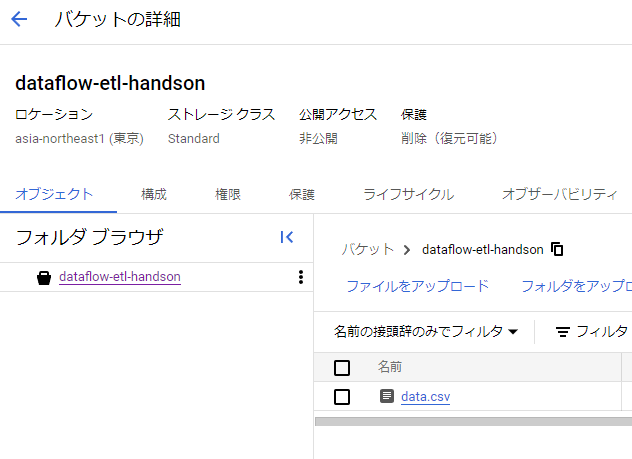
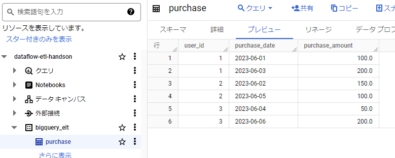
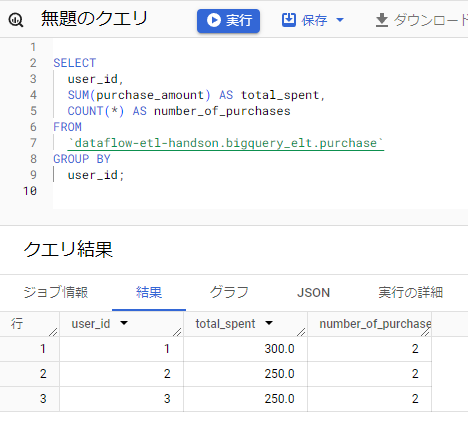
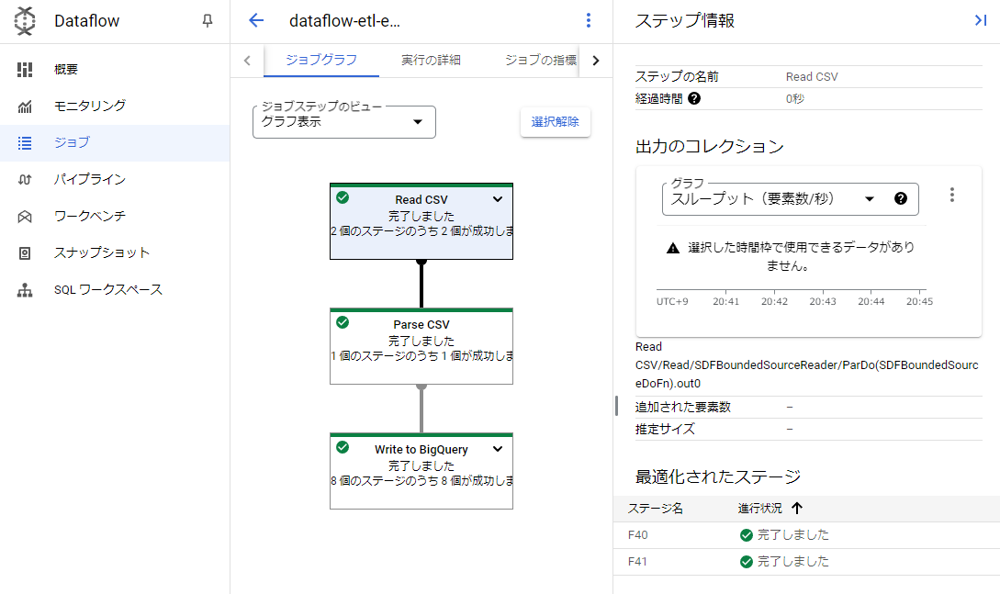
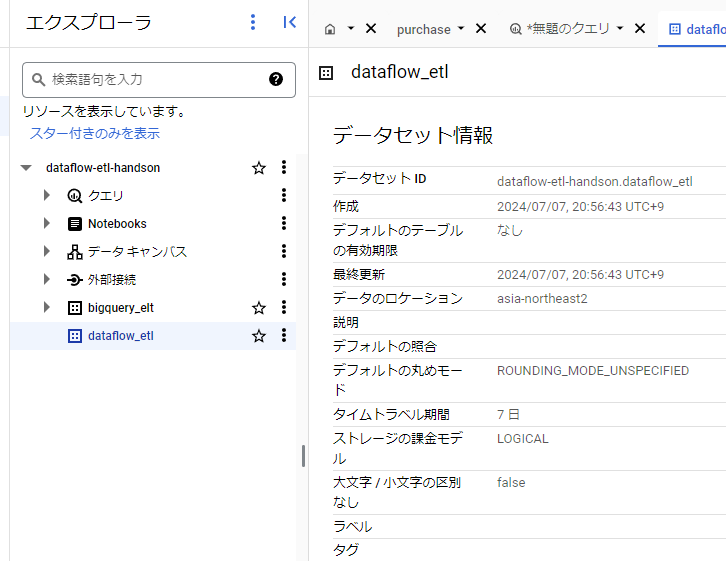

# 目的
- ELT/ETLを実際にやってみて違いを理解する
- Dataflowを実際に使ってみる

## BigQueryでELT
### Extract
- GCSバケットにcsvデータを保存

```csv
user_id,purchase_date,purchase_amount
1,2023-06-01,100.0
2,2023-06-02,150.0
1,2023-06-03,200.0
3,2023-06-04,50.0
2,2023-06-05,100.0
3,2023-06-06,200.0
```



### Load
- BigQueryデータセットを作る
- データセット内のテーブルをGCSバケットの`data.csv`から作る



### Transform
- BigQueryにてSQLクエリを実行する

```sql
SELECT 
  user_id,
  SUM(purchase_amount) AS total_spent,
  COUNT(*) AS number_of_purchases
FROM 
  `dataflow-etl-handson.bigquery_elt.purchase`
GROUP BY 
  user_id;
```



### ELTが適しているユースケース
- SQLで処理を完結できる場合
  - ここに関してはBQリモート関数で任意の処理も可能なので、必ずしもSQLで完結していなければELTにできないという訳ではない
- データソースが多岐に渡り、変換を後回しにしたい場合
  - データの素材達をどのように加工して示唆を得るか、という設計判断を遅延できる
  - DBTを使ったモデリングやデータマート構築もTransformの代表例となる
- DWH(≒BigQuery)の処理能力を最大限に活かしたい場合
  - ETLと比較するとELTはデータ移動のオーバーヘッドが少なく済む利点がある
- リアルタイム性が要求されない場合

## DataflowでETL

### Extract
- GCSバケットにcsvデータを保存

```csv
id,name,age,city
1,John Doe,30,New York
2,Jane Smith,25,Los Angeles
3,Bob Johnson,40,Chicago
```

### Transform
- 以下の手順でpythonコードからDataflowジョブを作成・実行
- 最初は`ap-northeast1`で実行していたが`ZONE_RESOURCE_POOL_EXHAUSTED`エラーが出た
  - [Cloud Dataflow を触ってみる](https://zenn.dev/hiramekun/scraps/6c7cecf1820fc8)
  - ↑の記事を参考に`ap-north-east2`に変更するとこのエラーは抑制された

```
rye sync
source .venv/bin/activate
gcloud auth application-default login
python main.py
```

#### main.py
```py
import apache_beam as beam
from apache_beam.options.pipeline_options import PipelineOptions, GoogleCloudOptions, StandardOptions
import csv

# パイプラインオプションを設定
pipeline_options = PipelineOptions()
google_cloud_options = pipeline_options.view_as(GoogleCloudOptions)
google_cloud_options.project = 'dataflow-etl-handson'
google_cloud_options.region = 'asia-northeast2'
google_cloud_options.job_name = 'dataflow-etl-example'
google_cloud_options.staging_location = 'gs://dataflow-etl-handson/staging'
google_cloud_options.temp_location = 'gs://dataflow-etl-handson/temp'
pipeline_options.view_as(StandardOptions).runner = 'DataflowRunner'

class ParseCSV(beam.DoFn):
    def process(self, element):
        import csv
        for row in csv.DictReader([element]):
            yield row

def run():
    with beam.Pipeline(options=pipeline_options) as p:
        rows = (
            p
            | 'Read CSV' >> beam.io.ReadFromText('gs://dataflow-etl-handson/etl-data.csv', skip_header_lines=1)
            | 'Parse CSV' >> beam.ParDo(ParseCSV())
            | 'Write to BigQuery' >> beam.io.WriteToBigQuery(
                'dataflow-etl-handson:dataflow_etl.personal_data',
                schema='id:INTEGER, name:STRING, age:INTEGER, city:STRING',
                write_disposition=beam.io.BigQueryDisposition.WRITE_TRUNCATE,
                create_disposition=beam.io.BigQueryDisposition.CREATE_IF_NEEDED
            )
        )

if __name__ == '__main__':
    run()
```



### Load
- 上記のpythonコードから作ったDataflowジョブにより、BQデータセットにテーブルが生成される
- という予定だったが、テーブルが生成されずデータセットが空のままだった




### ETLが適しているユースケース
- データ品質と事前のクレンジングが重視される場合
  - 不適格なデータを事前に弾く、フィルタリングしておきたい
- リアルタイム性が要求され、ストリーミング処理が必要な場合
- そこまでのリアルタイム性は要求されないものの、バッチ処理をしたい場合
